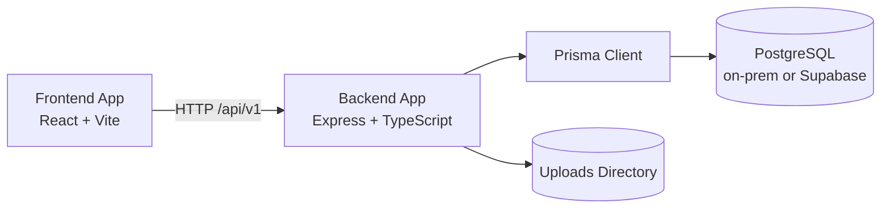

# My Personal Website

Monorepo for a full-stack personal website platform with a public-facing frontend and a CMS-style admin backend API.

## Overview

This repository contains two TypeScript applications:

- `frontend-app`: React + Vite SPA for public pages and admin UI.
- `backend-app`: Express + Prisma API that powers content, auth, and media uploads.

The project is intentionally kept as a single Git repository so frontend and backend evolve together.

### Current V1 behavior

- Public pages are content-driven from backend APIs (Home, About, Experience, Blog). Navigation labels stay in frontend translation files.
- Admin CMS uses schema-driven visual form editors (not raw JSON). Localized fields use English/Myanmar tabs, list fields support inline add/remove, and blog Markdown supports write/preview authoring.
- UI and content support English and Myanmar, with English fallback when Myanmar copy is missing.
- Public and admin UIs use a single light editorial theme. There is no light/dark/system toggle.
- PostgreSQL is required in every environment. `DATABASE_TARGET` selects on-prem PostgreSQL or Supabase.
- The first admin is created through a bootstrap-only flow. There is no public registration.

## Architecture

- Frontend communicates with backend via `/api/v1` endpoints.
- Backend exposes versioned REST routes for health, auth, public content, and admin operations.
- Prisma provides database access via PostgreSQL. `DATABASE_TARGET` resolves connection URLs before Prisma Client or Prisma CLI commands run.
- JWT-based auth protects admin endpoints (access token + httpOnly refresh cookie).



## Technology Stack

- Frontend: React 19, TypeScript, Vite, React Router, React Query, React Hook Form, shadcn/ui, Tailwind CSS, Lucide Icons, English/Myanmar i18n
- Backend: Node.js, Express 5, TypeScript, Prisma ORM, PostgreSQL, Zod, JWT, Multer
- Testing: Vitest + Testing Library (frontend), Jest + Supertest (backend)
- Tooling: ESLint, tsx, tsc

## Setup

### Prerequisites

- Node.js 20+
- npm 10+
- PostgreSQL (local/on-prem, or a Supabase project)

### 1) Install dependencies

```bash
cd backend-app && npm install
cd ../frontend-app && npm install
```

### 2) Configure environment files

```bash
cd backend-app && cp .env.example .env
cd ../frontend-app && cp .env.example .env
```

Required backend env values include `DATABASE_TARGET`, database URL(s) for that target, `JWT_ACCESS_SECRET`, and `JWT_REFRESH_SECRET`.

| `DATABASE_TARGET` | When to use | Required connection env |
| --- | --- | --- |
| `onprem` (default) | Local development, physical/on-prem servers, or any self-managed PostgreSQL | `DATABASE_URL` |
| `supabase` | Supabase-hosted PostgreSQL | `SUPABASE_DATABASE_URL` (pooled) and `SUPABASE_DIRECT_URL` (direct/session) |

Prisma schema always uses `provider = "postgresql"`. At runtime and for `npm run prisma:*` commands, the selected target is resolved into `DATABASE_URL` + `DIRECT_URL`.

Frontend only needs `VITE_BACKEND_API_URL` (defaults to `http://localhost:4000/api/v1`).

### 3) Prepare database

```bash
cd backend-app
npm run prisma:generate
npm run prisma:push
npm run prisma:seed
```

Optional, when iterating on schema with migrations:

```bash
npm run prisma:migrate
```

## Application Surfaces

### Public site

| Route | Purpose |
| --- | --- |
| `/` | Home |
| `/about` | About |
| `/experience` | Experience |
| `/blog` | Blog listing |
| `/blog/:slug` | Blog detail |

The public shell reads site title, contact information, social links, and page content from the API. A language toggle switches English/Myanmar.

### Admin portal

| Route | Purpose |
| --- | --- |
| `/admin/bootstrap` | Create the first admin (available only until one exists) |
| `/admin/login` | Admin login |
| `/admin/verify` | Token verification |
| `/admin` | Dashboard |
| `/admin/home`, `/admin/about`, `/admin/experience`, `/admin/projects`, `/admin/skills` | Visual CMS editors |
| `/admin/blog/posts`, `/admin/blog/categories`, `/admin/blog/tags` | Blog CMS |
| `/admin/uploads` | File upload management |
| `/admin/settings` | Site settings |

## Development Workflow

Use two terminals from the repository root.

### Backend

```bash
cd backend-app
npm run dev
```

### Frontend

```bash
cd frontend-app
npm run dev
```

Default local URLs:

- Frontend: `http://localhost:5173`
- Backend API: `http://localhost:4000/api/v1`

## DigitalOcean App Platform Deployment

This repository includes an App Platform spec at `.do/app.yaml` for running both applications from one GitHub repo with auto-deploy on push.

### What gets deployed

- `api` service from `backend-app` at route prefix `/api`
- `web` static site from `frontend-app` at route `/`
- Automatic rebuild/redeploy when pushing to `master`

### Setup steps

1. In DigitalOcean, create a new App and choose **Use App Spec**.
2. Upload or paste `.do/app.yaml`.
3. Update these environment values before first deploy:
  - `JWT_ACCESS_SECRET`
  - `JWT_REFRESH_SECRET`
  - `CORS_ORIGIN` (set to your deployed frontend origin, for example `https://your-app.ondigitalocean.app`)
4. Confirm GitHub repo access for `phyowaihtoon/personal-web-profile`.
5. Deploy.

### Notes for current backend database mode

- Backend uses PostgreSQL only.
- Choose deployment target with `DATABASE_TARGET=onprem` or `DATABASE_TARGET=supabase`.
- `.do/app.yaml` currently attaches DigitalOcean managed PostgreSQL as `DATABASE_URL`; leave that as-is unless you intentionally migrate that environment.

## Quality Checks

Backend:

```bash
cd backend-app
npm run lint
npm run test
npm run build
```

Frontend:

```bash
cd frontend-app
npm run lint
npm run test
npm run build
```

## Directory Structure

```text
.
|-- backend-app/
|   |-- prisma/
|   |-- scripts/
|   |   `-- with-database-env.ts
|   |-- src/
|   |   |-- config/
|   |   |   `-- database-target.ts
|   |   |-- controllers/
|   |   |-- middleware/
|   |   |-- routes/v1/
|   |   |-- services/
|   |   |-- utils/
|   |   `-- validators/
|   `-- tests/
|-- frontend-app/
|   |-- public/
|   |-- src/
|   |   |-- app/
|   |   |-- components/
|   |   |-- features/
|   |   |   `-- cms/
|   |   |-- lib/
|   |   |-- pages/
|   |   `-- translations/
|   `-- test/
|-- PROJECT_SPEC.html
|-- PROJECT_SPEC.md
`-- README.md
```

## Notes

- Generated artifacts (`node_modules`, `dist`, local `.env`) are ignored by Git.
- Upload files are stored locally in development and are also ignored by Git.
- Full product requirements live in `PROJECT_SPEC.md`.
