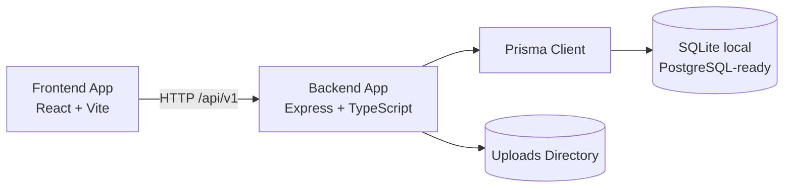

# My Personal Website

Monorepo for a full-stack personal website platform with a public-facing frontend and a CMS-style admin backend API.

## Overview

This repository contains two TypeScript applications:

- `frontend-app`: React + Vite SPA for public pages and admin UI.
- `backend-app`: Express + Prisma API that powers content, auth, and media uploads.

The project is intentionally kept as a single Git repository so frontend and backend evolve together.

## Architecture

- Frontend communicates with backend via `/api/v1` endpoints.
- Backend exposes versioned REST routes for health, auth, public content, and admin operations.
- Prisma provides database access (SQLite for local development).
- JWT-based auth protects admin endpoints.



## Technology Stack

- Frontend: React 19, TypeScript, Vite, React Router, React Query, React Hook Form, Tailwind CSS
- Backend: Node.js, Express 5, TypeScript, Prisma ORM, Zod, JWT, Multer
- Testing: Vitest + Testing Library (frontend), Jest + Supertest (backend)
- Tooling: ESLint, tsx, tsc

## Setup

### Prerequisites

- Node.js 20+
- npm 10+

### 1) Install dependencies

```bash
cd backend-app && npm install
cd ../frontend-app && npm install
```

### 2) Configure environment files

```bash
cd backend-app && cp .env.example .env
cd ../frontend-app && cp .env.example .env
```

Required backend env values include `DATABASE_URL`, `JWT_ACCESS_SECRET`, and `JWT_REFRESH_SECRET`.

### 3) Prepare database

```bash
cd backend-app
npm run prisma:generate
npm run prisma:push
npm run prisma:seed
```

## Development Workflow

Use two terminals from the repository root.

### Backend

```bash
cd backend-app
npm run dev
```

### Frontend

```bash
cd frontend-app
npm run dev
```

Default local URLs:

- Frontend: `http://localhost:5173`
- Backend API: `http://localhost:4000/api/v1`

## Quality Checks

Backend:

```bash
cd backend-app
npm run lint
npm run test
npm run build
```

Frontend:

```bash
cd frontend-app
npm run lint
npm run test
npm run build
```

## Directory Structure

```text
.
|-- backend-app/
|   |-- prisma/
|   |-- src/
|   |   |-- config/
|   |   |-- controllers/
|   |   |-- middleware/
|   |   |-- routes/v1/
|   |   |-- services/
|   |   |-- utils/
|   |   `-- validators/
|   `-- tests/
|-- frontend-app/
|   |-- public/
|   |-- src/
|   |   |-- app/
|   |   |-- components/
|   |   |-- features/
|   |   |-- lib/
|   |   |-- pages/
|   |   `-- translations/
|   `-- test/
|-- PROJECT_SPEC.html
|-- PROJECT_SPEC.md
`-- README.md
```

## Notes

- Generated artifacts (`node_modules`, `dist`, local `.env`, SQLite runtime files) are ignored by Git.
- Upload files are stored locally in development and are also ignored by Git.
